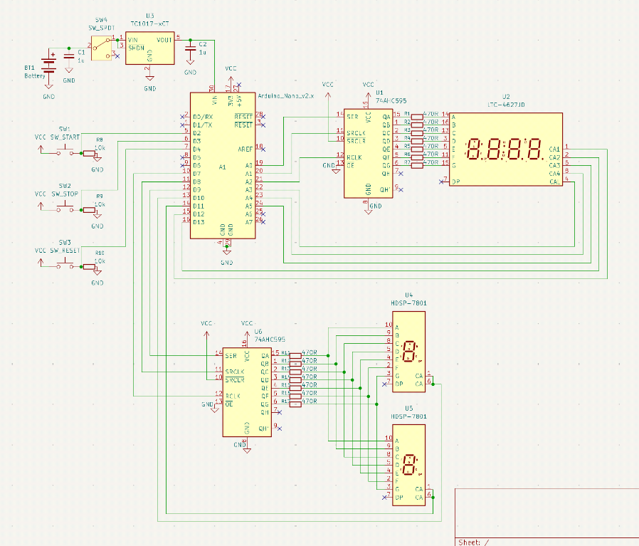
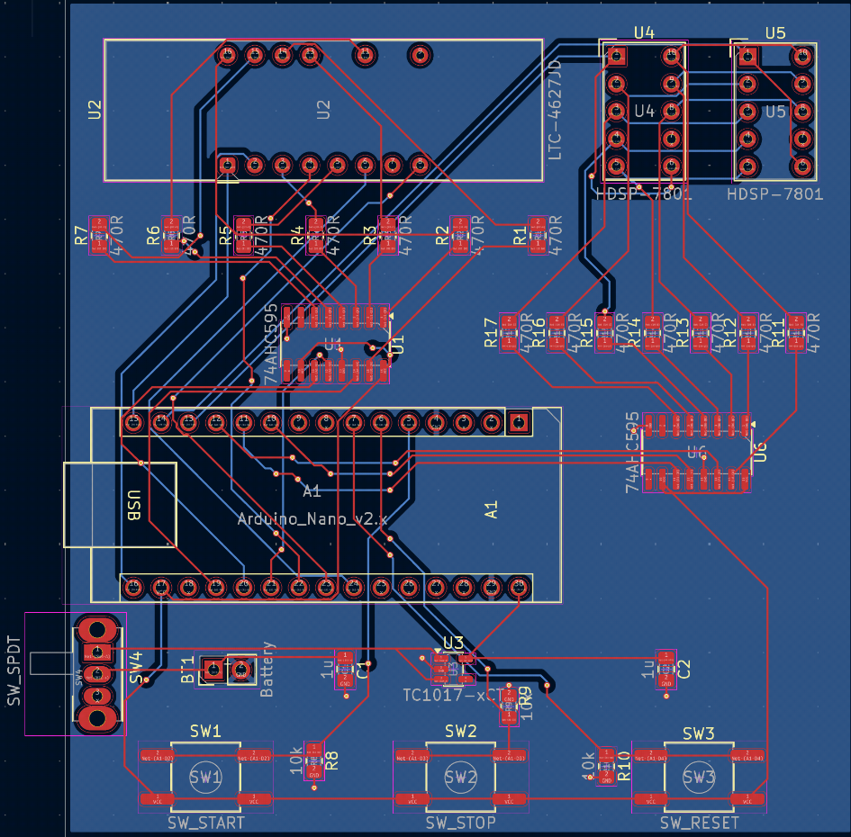

# Stopwatch
This is a simple stopwatch PCB that was intended for me to get into the complex world of PCB design and microcontrollers on PCBs. It functions like a regular stopwatch, you cna start the timer, stop it, and reset it, and it has an accuracy to tens of miliseconds.

## Schematic

the schematic looks like this, it consists of several HC595 8-bit shift registers to multiplex the MCU's pins for minimal pin usage on displays, some buttons for control, and a 3.3V regulator to regulate a 3xAA battery's voltage to power the MCU in a stable fashion.

## PCB 

The PCB uses only 2 layers to be as cost effective as possible and stays within 100mm x 100mm to capitalize on JLCPCB's lowest cost threshold. It was designed in a way where traces of similar functionality are grouped together, but not close enough to be affected by other traces by Faraday's Law.

## Physical Build
Still in the design review process, if you noticed, there are quite a few SMD components, which may be a bit complicated to solder by hand, but I have a lot of experience soldering SMD, especially SOIC, so I should have little trouble.